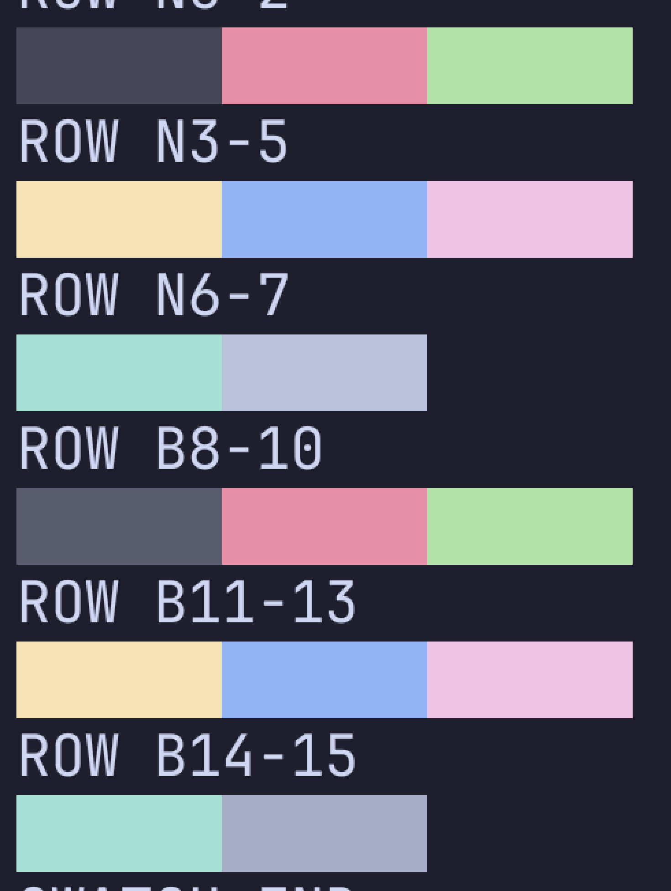

# 终端配色 Catppuccin Mocha 真机验收（16 色基线 · 2026-10-10）

> 分支 `feature/terminal-color`（自 `feature/terminal-font` 的 `c56a361` 切出，**不合并 main**；`main` 停在 `7f5b3289f9e0d1fd6e48001e5fc38c916433a327`）
> 设备 `AD3J023824001723`（Honor PGT-AN10 / Android 16 / arm64-v8a，屏幕 1312×2848，density 560）
> 包 `zhengdao-2.0.9-benchmark.apk`（14,188,475 B，`lastUpdateTime=2026-10-10 22:16:39`）
> 单测 `CatppuccinPaletteTest` `tests="9" failures="0" errors="0"`
> **结论：16 个 ANSI 色 + 4 个特殊色在真机上逐通道正确**——屏幕像素 = 规格值经 sRGB→Display-P3 变换后**误差 0（16/16）**；`ls --color`、`git diff`、`vim` 语法高亮、`grep --color` 都按配色上色。唯一没验收成的是 **htop**：proot 下读不到 `/proc/stat`，属环境限制，不是配色问题。

## 一、结论速览

| 验收项 | 结果 | 证据 |
| --- | --- | --- |
| 16 色 ANSI normal 0-7 | ✅ | §3.2，P3 判定误差 0 |
| 16 色 ANSI bright 8-15 | ✅ | §3.2 + §3.3 配对表 |
| 基础色 bg / fg / cursor | ✅ | bg `#1E1E2E`（实测 `#1E1E2D`）、fg `#CDD6F4`、cursor `#F5E0DC` |
| 选区底色 `#585B70` | ✅ | §3.4，长按选中后实测 `#595B6E` = P3(`#585B70`) |
| `ls --color` | ✅ | 压缩包红、符号链接青、可执行绿（§4.1） |
| `git diff` 红绿 | ✅ | `-alpha` 红 / `+alpha changed`、`+gamma` 绿 / `@@` 青（§4.2） |
| vim 语法高亮 | ✅ | 注释蓝、关键字与字符串品红、数字黄、`None` 青绿（§4.3） |
| `grep --color=always` | ✅ | 匹配项红（§4.4） |
| htop 柱状图 | ⛔ 环境不支持 | `Cannot open /proc/stat: Permission denied`（§4.5） |
| 未碰 4 个 XML | ✅ | `git status` 只有 4 个 java/kt + 1 个测试文件 |
| 不合并 main | ✅ | `main` 未动，见文首 |

## 二、配色落点（改了什么、为什么）

调色板是引擎侧的全局单例：`com/termux/terminal/TerminalColors.java:9` 的 `public static final TerminalColorScheme COLOR_SCHEME`，16 个 ANSI 色写在它的 `mDefaultColors` 里。应用的 4 个配色（`classic` / 等宽 / 等）原本只带 bg/fg/cursor **三个**颜色，16 色来自引擎出厂 xterm 调色板。所以「新增一套配色」必须同时做两件事：把 16 色写进调色板 + 让 `Scheme` 能携带它们。

| 文件 | 改动 |
| --- | --- |
| `app/src/main/java/com/termux/terminal/TextStyle.java` | 新增 `public final static int COLOR_INDEX_SELECTION = 259;`（javadoc：0 = 本配色没指定 ⇒ 渲染层退回反色）；`NUM_INDEXED_COLORS` 259 → **260** |
| `app/src/main/java/com/termux/terminal/TerminalColorScheme.java` | `DEFAULT_COLORSCHEME` 补第四个特殊色 `0x00000000`；`private void reset()` → **`public void reset()`**（换配色前先整体归零，防上一套的 16 色残留） |
| `app/src/main/java/com/termux/view/TerminalRenderer.java` | `drawTextRun(...)` 末尾新增 `boolean insideSelection`；两处调用点把 `reverseVideo \|\| invertCursorTextColor \|\| lastRunInsideSelection` 拆成前两位 + `lastRunInsideSelection`；方法体在反色交换**之后**加：`palette[COLOR_INDEX_SELECTION] != 0` 就用它当底色，否则维持反色 |
| `app/src/main/java/com/example/zhengdao/terminal/TerminalPrefs.kt` | 新增 `CATPPUCCIN_MOCHA_ANSI`（16 色）、`Scheme` 加两个带默认值的字段 `selection: Int = 0` / `ansi: IntArray? = null`、新增条目 `CATPPUCCIN_MOCHA("catppuccin_mocha", "Catppuccin Mocha", 0xFF1E1E2E, 0xFFCDD6F4, 0xFFF5E0DC, 0xFF585B70, …ANSI)`、`DEFAULT_SCHEME` 改 `"catppuccin_mocha"`、`applyScheme()` 拆出可单测的 `writePalette(scheme)` |
| `app/src/test/java/com/example/zhengdao/terminal/CatppuccinPaletteTest.kt` | 新建，9 个用例（16 色逐色、4 个特殊色、bright/normal 恰好 6 对同色、默认配色、未知 id 回落、其余配色 selection=0、`writePalette` 写入、切回 CLASSIC 还原出厂色、老配色仍可枚举） |

**为什么用「新增调色板索引」而不是给 `TerminalView` 加 `setSelectionColor`**：颜色统一由调色板承载（渲染层只认 `palette[]`），而 `applyScheme()` 本来就有写调色板的通道；这样选区色跟其它颜色走同一条路，也顺手让 4 个老配色保持 `selection = 0`（观感一字不变，仍用反色画选区）。

**对引擎的副作用预期**：`TerminalEmulator` 的 OSC 10/11/12 走 `COLOR_INDEX_FOREGROUND + (value - 10)` 且以 `specialIndex > COLOR_INDEX_CURSOR` 判非法 ⇒ 新增的 259 不会被 OSC 写到。

## 三、16 色真机量化

### 3.1 判据设计（为什么不能直接拿像素比规格）

`adb shell screencap` 抓的是**合成后的显示缓冲**，这台机器的面板是广色域，缓冲区里的数值是 **Display-P3** 编码 —— 直接跟 sRGB 规格比，饱和色会「看起来差十几」。所以判据分两步：

1. 用 Pillow 从截图里逐块量出实际像素（16 色块，每块 6 列宽 = 150 px）；
2. 把**规格色**做 sRGB → XYZ(D65) → Display-P3 变换，与实测逐通道比对。若变换后完全一致，就说明 App 写进调色板的确实是规格值，偏差全部来自显示色彩空间。

色块脚本 `zd-color-swatch.sh` 每行 3 块（保持 x < 561，避开系统画中画浮窗），量测脚本见 §七。

### 3.2 实测数据（`01-swatch16.webp` / `08-zoom-swatch16.png`）

| ANSI | 规格（sRGB→P3 预测） | 实测像素 | 偏差 |
| --- | --- | --- | --- |
| 0 black | `#45475A` → `#454758` | `#454758` | 0 |
| 1 red | `#F38BA8` → `#E590A8` | `#E590A8` | 0 |
| 2 green | `#A6E3A1` → `#B3E1A7` | `#B3E1A7` | 0 |
| 3 yellow | `#F9E2AF` → `#F5E3B5` | `#F5E3B5` | 0 |
| 4 blue | `#89B4FA` → `#92B3F4` | `#92B3F4` | 0 |
| 5 magenta | `#F5C2E7` → `#EDC4E5` | `#EDC4E5` | 0 |
| 6 cyan | `#94E2D5` → `#A5E0D5` | `#A5E0D5` | 0 |
| 7 white | `#BAC2DE` → `#BBC2DC` | `#BBC2DC` | 0 |
| 8 bright black | `#585B70` → `#595B6E` | `#595B6E` | 0 |
| 9..14 | 与 1..6 **同规格** | 与 1..6 实测**逐位相同** | 0 |
| 15 bright white | `#A6ADC8` → `#A7ADC6` | `#A7ADC6` | 0 |

**16/16 误差 0**（每通道 0/255）。换算里用的是标准 sRGB↔P3 矩阵 + sRGB 传输函数，没有拟合参数。

### 3.3 Bright 与 Normal 大部分同色 —— 这是设计，不是写错

`bright 1..6` 与 `normal 1..6` 规格完全相同（只剩 `8 = #585B70`、`15 = #A6ADC8` 与 normal 不同）。实测里两支**逐位相同**（`#E590A8` / `#B3E1A7` / `#F5E3B5` / `#92B3F4` / `#EDC4E5` / `#A5E0D5` 各出现两次），与 Catppuccin 的设计一致；单测里用「同色对恰好 6 对」把这个特征钉住了。

### 3.4 选区底色（新增的 palette 索引 259，`05-selection-color.webp`）

tmux 的鼠标模式会吃掉手势，长按选中前先 `tmux set -g mouse off`（验完已恢复 `on`）。长按后出现系统的「复制 / 更多」浮动菜单，选中词块的底色实测 **`#595B6E`**，正是 P3(`#585B70`) ⇒ 走的是新加的 `palette[259]`，不是反色。其余 4 个配色 `selection = 0`，仍按反色画（单测覆盖）。

## 四、真实工具验证

### 4.1 `ls --color`（`02-ls-color.webp`）

`arc.tgz` 红（=`#F38BA8`）、`link.txt` 青（符号链接，`ls -F` 追加 `@`）、`/usr/bin` 下可执行文件整片绿（实测 `#B3E1A7` = P3(`#A6E3A1`)）。

### 4.2 `git diff` 红绿（`03-git-diff-color.webp`）

在 rootfs 里现建仓库：`-alpha` 红、`+alpha changed` / `+gamma` 绿、`@@ -1,2 +1,3 @@` 青、`index …` 与 `--- / +++` 行按 git 默认上色。

> 顺带发现：这个 rootfs 的 git 对 `git status --color=always -s` 报 `error: unknown option`（git 版本差异，与配色无关）。`git diff --color=always` 正常。

### 4.3 vim 语法高亮（`04-vim-syntax.webp`）

rootfs 里原本**没有 vim**，`apt-get install -y --no-install-recommends vim htop`（rc=0，装的是 `vim.basic`）后：`vim -c 'set background=dark' -c 'syntax on'` 打开一个 Python 文件 —— 注释蓝、`def/if/for/return/class` 品红、字符串品红、数字黄、`None` 青绿、行号灰。

### 4.4 `grep --color=always`

`echo "alpha beta gamma" | grep --color=always -E 'beta'` ⇒ 匹配项红色（`#E590A8`-系）。

### 4.5 htop —— 环境不支持（`06-htop-blocked.webp`、`07-top-fallback.webp`）

`htop` 直接报 **`Cannot open /proc/stat: Permission denied`**；`head -c 40 /proc/stat` 同样 `rc=1` ⇒ proot 里 `/proc/stat` 不可读，htop 拿不到 CPU 数据，**柱状图这一项在本机无法验收**（与配色无关，任何配色都一样）。`top` 能启动（有分隔行、表头反显），同样因为读不到 `/proc/stat` 而不显示 CPU 表。

因此 16 色的**柱状图类**证据由 §三 的色块量化替代 —— 它比 htop 截图更严格（逐通道、可复算）。

## 五、量法的坑

1. **截图是 P3，不是 sRGB**：拿像素直接比规格会得出「差十几」的假差异；先做 sRGB→P3 变换再比，本页数据即由此得出。
2. **系统画中画浮窗遮挡**：本机常驻一个小窗（约 x≥561、y 531..1706），色块必须排在 **x < 561**（本脚本每行 3 块）；`ls -l` 那种长行会把文件名推到被遮挡区，改用不带 `-l` 的 `ls --color=always`。
3. **色块行探测阈值**：每行 2 块的排布在「x 0..545 每 4 px 采样、非背景 > 90」下会被判成非色块行 —— 阈值要降到 ~55，或干脆每行 3 块。
4. **`echo` 不解释 `\033`**：上色一律用 `printf`（第一版把转义序列原样打了出来）。
5. **选中要先关 tmux 鼠标模式**：`mouse on` 时触摸走滚轮转发分支，长按选不出文本。
6. **注入命令里的空格必须写 `%s`**（`adb shell input text "bash%s/sdcard/x.sh"`），脚本本身必须 LF 换行。
7. **观察（未定性）**：带较大水平位移的长按拖拽让 `TerminalActivity` 被销毁了一次（logcat 只有 `ACTIVITY_DESTROYED`，无崩溃、无 ANR，重启后 tmux 会话完好）。与配色无关，记在这里备查。

## 六、未做项与影响

- `noCompress` / 字体子集化：按项目所有者 2026-10-10 决定**先不做**（等配色/间距定完一起评估）。本次只改配色，APK 体积与字体任务结束时持平（14,188,475 B）。
- 环境副作用：为验收往 rootfs 里装了 `vim`（`vim.basic`）与 `htop`。**htop 在本机不可用**；要不要卸掉由项目所有者定。
- 未合并 `main`：`feature/terminal-color` 独立分支，`main` 未动。

## 七、怎么复跑

```powershell
# 装包（benchmark 变体，applicationId 无后缀 ⇒ -r 覆盖，Debian 环境不丢）
$adb = "$env:LOCALAPPDATA\Android\Sdk\platform-tools\adb.exe"
$env:JAVA_HOME='D:\Program Files\Android\Android Studio\jbr'
.\gradlew.bat :app:assembleBenchmark --console=plain -q
& $adb install -r app\build\outputs\apk\benchmark\zhengdao-2.0.9-benchmark.apk
# 进终端页（底部 Tab：终端 656,2768），等 tmux 挂载
# 注入并执行（空格必须写 %s）：
& $adb push "$env:TEMP\zd-color-swatch.sh" /sdcard/zd-color-swatch.sh
& $adb shell input text "bash%s/sdcard/zd-color-swatch.sh"; & $adb shell input keyevent 66
& $adb shell screencap -p /sdcard/zd-swatch.png; & $adb pull /sdcard/zd-swatch.png "$env:TEMP\zd-swatch.png"
# 量测（Pillow，本机 bundled python）：
& "C:\Users\guoli\.dsh\dsh-runtimes\dsh-primary-runtime\dependencies\python\python.exe" `
  "$env:TEMP\zd-color-measure.py" "$env:TEMP\zd-swatch.png"   # 逐块取色（阈值 55）
& "C:\Users\guoli\.dsh\dsh-runtimes\dsh-primary-runtime\dependencies\python\python.exe" `
  "$env:TEMP\zd-color-p3.py"                                  # 规格 → P3 预测，与实测比对
```

单测：`.\gradlew.bat :app:testDebugUnitTest --tests '*CatppuccinPaletteTest*'`（报告 `app\build\test-results\testDebugUnitTest\TEST-com.example.zhengdao.terminal.CatppuccinPaletteTest.xml`）。

## 八、截图留档（已归档进仓库）

目录 `docs/acceptance/assets/terminal-color-2026-10-10/`（整屏图转 q90 WebP，量测判据图用无损 PNG，与 `.gitignore` 的 `*-zoom-*` 约定一致）：

| 文件 | 内容 | 字节 |
| --- | --- | --- |
| `00-before-color.webp` | 换上 Catppuccin **之前**的终端（黑底 + 绿状态栏），对照用 | 170,634 |
| `01-swatch16.webp` | 16 色块六行（§3.2 的原始截图） | 160,768 |
| `02-ls-color.webp` | 工具可用性 + `ls --color`（红压缩包 / 青链接） | 172,232 |
| `03-git-diff-color.webp` | `git diff --color=always` 红绿青 | 179,234 |
| `04-vim-syntax.webp` | vim + `background=dark` + `syntax on` | 160,430 |
| `05-selection-color.webp` | 长按选中（复制/更多菜单）+ 选区底色 | 166,550 |
| `06-htop-blocked.webp` | htop `/proc/stat` 报错 + grep 红 + top -b | 187,302 |
| `07-top-fallback.webp` | 交互式 top（读不到 /proc/stat，无 CPU 表） | 147,296 |
| `08-zoom-swatch16.png` | **无损**放大 ×3 的 16 色块（1470×1950） | 44,646 |

左图即主判据：



## 九、这份基线怎么用

- **换了字体、改了字号/间距、或以后调 `noCompress`**：重跑 §七 的色块 + P3 判定，16 行必须全 0；出现非 0 就先查是不是显示色彩空间变了（比如切成 sRGB 色彩模式），再查代码。
- **改了任何配色常量**：`CatppuccinPaletteTest` 会先拦住（逐色断言）；真机只需抽查 `ls --color` 一类。
- **给别的配色加选区底色**：照 §2 的 `palette[259]` 路子，记得 `selection = 0` 表示「不指定，退回反色」，别把反色行为改掉。
- **`htop` 依赖 `/proc/stat`**：proot 下不可用；若将来要让终端里能跑 htop，得先解决 `/proc` 暴露，这跟配色是两件事。

## 相关文档

- `docs/acceptance/terminal-font-2026-10-10.md`（字体与 2:1 对齐基线）
- `docs/acceptance/terminal-view-refactor-p1-2026-10-10.md`（P1 视图重构验收）
- `docs/acceptance/terminal-render-p0-2026-10-10.md`（渲染层测量）
