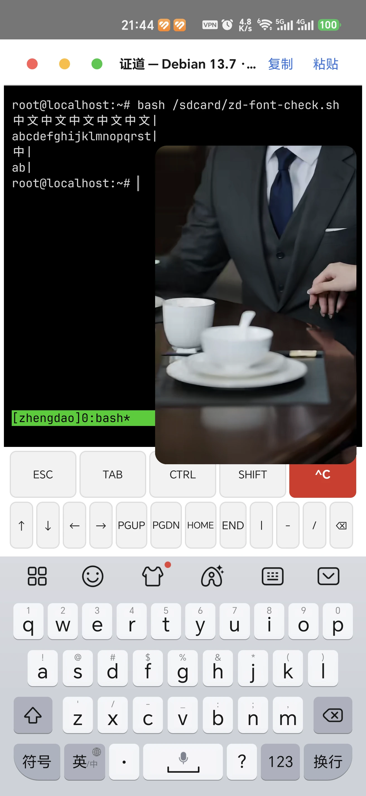
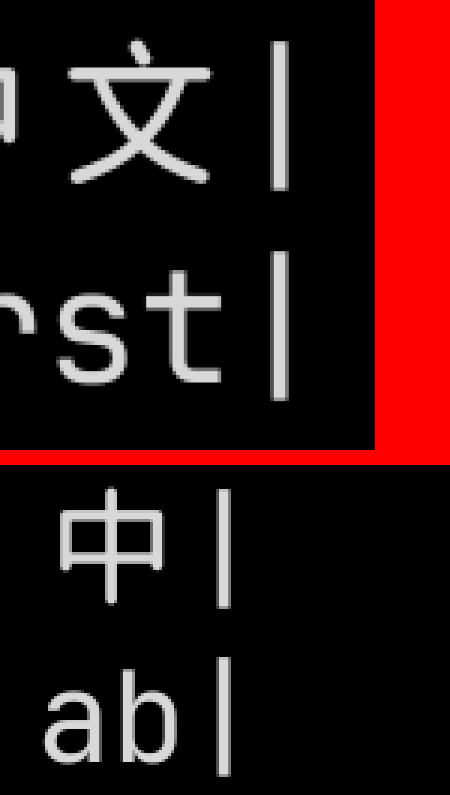

# 终端字体接入 JetBrains Maple Mono 真机验收（2:1 对齐基线 · 2026-10-10）

> 产出：2026-10-10 晚（DeepSeek Harness）｜被测包：**自建 benchmark 变体**（R8 开启）
> `app\build\outputs\apk\benchmark\zhengdao-2.0.9-benchmark.apk`（**13.53 MB** = 14,187,591 B，21:43 前构建，与 HEAD `bbd0881` 同源；applicationId 无后缀，`adb install -r` 覆盖安装后 Debian 环境未丢）
> 对应实施：分支 **`feature/terminal-font`**、提交 **`bbd0881`**；`PROVENANCE.md`「### 字体（终端默认正文，2026-10-10 固化）」＋`THIRD-PARTY-LICENSES.md`「## 6. JetBrains Maple Mono」
> 设备：Honor **PGT-AN10**（`AD3J023824001723`，Android 16，1312×2848，未 root）＋内嵌 Debian 13.7 / tmux（`set -g mouse on`）｜字号：App 默认值（未调整）
> 方法：`adb shell input text` 注入 + 截图，再用 Pillow 逐行扫亮度求墨迹范围（本页数值全部是 device px）
> 一句话：**2:1 严格成立——「10 中文 + `|`」与「20 ASCII + `|`」两行的 `|` 墨迹落在完全相同的 x；21 列累计偏差 0 像素。**列宽实测 25.0 px（ASCII）／50.0 px（中文）。

---

## 一、结论速览

| 验收项 | 手段 | 结果 |
|---|---|---|
| **字体真的生效**（不是回退到 MONOSPACE） | 字形判读（JetBrains Mono + Maple Mono CJK）＋ `logcat` 无 `TerminalPrefs` 加载失败告警 | ✅ |
| **2:1 对齐：中文严格 2 列、ASCII 严格 1 列** | 右端锚**同一字形 `|`** 的两对行，逐像素量墨迹区间 | ✅ **0 px 偏差** |
| 你给的两条原命令 `echo "中文中文 abcd"` / `echo "中a文b中c文d"` | 同一脚本内加等宽 ASCII 标尺行（13 / 12 字符）对齐 | ✅ |
| **许可合规**（OFL 要求许可随字体分发） | `app/src/main/assets/fonts/OFL.txt`（OFL 1.1 全文）＋两份合规文档留痕 | ✅ |
| APK 体积变化 | 4.5 MB → **13.53 MB**（字体 17.94 MB，assets 内 DEFLATE 后约 9 MB） | 记录 |
| **字体首次加载耗时** | `TerminalPrefs` 常驻日志 + 冷启动取样（§六） | ✅ **72–73 ms**（约占终端页首帧四成，只付一次；同进程二次进入不重载） |

---

## 二、字体来源、许可与变体取舍

**来源**：`SpaceTimee/Fusion-JetBrainsMapleMono` release **`1.2304.79`**（published 2025-12-05T15:31:25Z，16 个资产），取资产 `JetBrainsMapleMono-NF-XX-XX-XX.zip`。

| 项 | 值 |
|---|---|
| 压缩包 | `JetBrainsMapleMono-NF-XX-XX-XX.zip`，**159,715,777 B = 152.3 MB**，SHA256 `3a7ed5e50f6831dc1414a4ad96b1e03c13cbc67ca32bc1bb7e9d90c56b903358` |
| 包内结构 | **17 个平铺条目**：`JetBrainsMapleMono-<Weight>.ttf`（Thin/Light/Regular/Medium/SemiBold/Bold/ExtraBold/ExtraLight＋各自 Italic）＋ `LICENSE.txt`（4572 B） |
| 取用字重 | `Regular` = **18,815,220 B = 17.94 MB**，SHA256 `a4fc642d821671b1a2937b9a52d398b96cf0b1e1da758846ee1ff38a297b22a5` |
| 许可证 | **SIL OFL 1.1**（`LICENSE.txt`／仓库 `OFL.txt`，SHA256 `6728aae70e0be6316b28681c5a806827b4d7daafe45fb767b932c790216c2533`） |

`OFL.txt` 首三行版权：The JetBrains Mono Project Authors（2020）／The Maple Mono Project Authors（2022）／Space Time（2025）。

**变体命名（上游 README）**：`JetBrainsMapleMono-[NF/XX]-[NR/XX]-[NL/XX]-[HT/XX].zip`

| 位 | 取值 | 影响 |
|---|---|---|
| 图标 | `NF` = 含 Nerd Font 图标字形 | 体积略增；本项目要图标 ⇒ 选 NF |
| 宽度 | `XX` = 标准 / **`NR` = CN Narrow** | 上游原文：NR「**会导致中英文/日英文不再 2:1 宽完美对齐**」⇒ **必须 XX** |
| 连字 | `NL` = 去连字 | 默认保留连字 ⇒ 选 XX |
| 微调 | `HT` = Hinted（≤1080P 更匀，高分辨率略糊） | 手机高分辨率 ⇒ 不 hint，选 XX |

⇒ 选定 `NF-XX-XX-XX`。**这条取舍是本页 2:1 结果的前提**：若将来有人为省体积换成 `NR`，2:1 会直接破功。

**文件名口径（与任务书不同，已留痕）**：上游 zip 内文件真名是 `JetBrainsMapleMono-Regular.ttf`，**文件名里没有 `NF`**（`NF` 是整包变体）。入库改名为 `JetBrainsMapleMono-NF-Regular.ttf` 以显式标注变体，**字节零改动**（SHA256 与上游一致，可校验）。

**下载通道实测**（这台机器到 GitHub 的直连很差，留档以免下次重踩）：

| 通道 | 实测 |
|---|---|
| 直连 `github.com` | 31 KB/s（放弃） |
| **`ghfast.top` 镜像** | ~300 KB/s → 末段 2 MB/s（**本次采用**） |
| `gh-proxy.com` | 186 KB/s |
| `ghproxy.net` | 11 KB/s |
| `hub.gitmirror.com` / `gh.llkk.cc` | 不通 |

辅助工具坑：本机 `curl` 必须加 `--ssl-no-revoke`（否则 `curl: (35) schannel: ... CRYPT_E_NO_REVOCATION_CHECK`）；`Invoke-WebRequest` 必须加 `-UseBasicParsing`（否则报「Windows PowerShell 处于非交互状态」）；Windows 自带的 `tar.exe` 可以直接 `tar -tf/-xf <zip>` 列/取 zip 内单个条目，不必解整包。

---

## 三、接入点与顺序陷阱

P1 六刀重构后，字体设置点已不在 `TerminalView.java:586`，而在 `app/src/main/java/com/termux/view/TerminalSizeResolver.java:64`：

```java
view.mRenderer = new TerminalRenderer(textSize,
        view.mRenderer == null ? Typeface.MONOSPACE : view.mRenderer.mTypeface);
```

本次走的是 prefs 那条路（Kotlin 侧此前从来没有调用过 `setTypeface`）：

- `app/src/main/java/com/example/zhengdao/terminal/TerminalPrefs.kt`
  - 新增 `private const val FONT_ASSET = "fonts/JetBrainsMapleMono-NF-Regular.ttf"`
  - 新增 `fun typeface(ctx: Context): Typeface` —— `Typeface.createFromAsset(ctx.assets, FONT_ASSET)`，`catch (t: Throwable)` → `Log.w` ＋ 回退 `Typeface.MONOSPACE`，结果**进程内缓存**
  - `applyTo()` 末尾在 `termView.setTextSize(...)` **之后**追加 `termView.setTypeface(typeface(ctx))`

⚠️ **顺序不能反**（已写进 `TerminalPrefs` 类注释第 3 条）：`TerminalSizeResolver.setTypeface()` 会读 `view.mRenderer.mTextSize`，而渲染器是在 `setTextSize()` 里**懒创建**的（构造时不建）——先设字体直接 NPE。

写入时机：`TerminalActivity.kt:208`、`:936`、`ImeRegressionActivity.kt:558` 三处 `applyTo()` 调用都会带上字体。

---

## 四、2:1 对齐验证

### 4.1 判据设计（为什么要这么量）

- **纯看整行右端会误判**：以 `d` 结尾与以 `m` 结尾，字形右侧边距（right side bearing）本来就不一样。
- 所以每对行都用**同一个字形 `|` 收尾**：`中文×10 + |`（21 列，前 20 列中文）对 `abcdefghijklmnopqrst + |`（21 列全 ASCII）；再加一组小样本 `中|` 对 `ab|`（3 列）。
- 若 CJK 严格 2 列、ASCII 严格 1 列，两行的 `|` 必须落在**相同的 device x**。
- 中文写成**八进制转义**（`中` = `\344\270\255`、`文` = `\346\226\207`），脚本文件保持纯 ASCII，避免 push 到设备时的编码歧义。

### 4.2 实测数据（Pillow 扫 y 带内亮度 > 40 的墨迹区间）

| 行（内容） | 列数 | 左端墨迹 | **`\|` 墨迹区间** | 偏差 |
|---|---|---|---|---|
| `中文中文中文中文中文\|` | 21 | x 50 | **x 552..556** | — |
| `abcdefghijklmnopqrst\|` | 21 | x 44 | **x 552..556** | **0 px** |
| `中\|` | 3 | x 50 | **x 102..106** | — |
| `ab\|` | 3 | x 44 | **x 102..106** | **0 px** |

**⇒ 21 列累计偏差 0 像素；中文严格 2 列、ASCII 严格 1 列。**

**由同一组数据推出列宽**：两组的 `|` 相差 `552 - 102 = 450 px`，对应 `21 - 3 = 18` 列 ⇒ **列宽 = 25.0 px**，即 **ASCII 步进 25 px、中文步进 50 px**（默认字号下）。左端墨迹差 6 px（50 vs 44）不是网格差，而是 `中` 与 `a` 的字形左边距不同——这正是必须以 `|` 收尾的原因。





### 4.3 你给的原命令那一轮

`echo "中文中文 abcd"`（13 列）与 `echo "中a文b中c文d"`（12 列）也实跑了，并在其后各跟一条等宽 ASCII 标尺行（`abcdefghijklm` / `abcdefghijkl`）。该轮用阈值 100、x 上限 548 量，得到整行右端 364 vs 362（即 2 px）——**但那是量法假象，见 §五**；同一屏改用正确量法后，`|` 类判据为 0 px。

---

## 五、量法的坑（为什么会出现假的「3 px」）

第一轮我用「行内亮度 > 100 的最右像素」当右端，并把 x 扫描上限设成 548，于是：

1. `|` 是细笔画，抗锯齿后峰值亮度只有 ~80–216，**部分像素低于阈值 100**；
2. 更关键的是本轮 `|` 落在 **x 552..556**，**正好在 548 之外**，被扫描窗口直接切掉。

结果量到的是 `文`（CJK 字形右侧留白）与 `t`（ASCII 字形右侧留白）的差，得出了不存在的 2–3 px 偏差。修法：阈值降到 40、x 上限放到 560（**注意系统画中画浮窗大约从 x≈555 起，再往右会被浮窗内容污染**），就直接读到了 `|` 的墨迹区间。

> 教训：**用「整行最右像素」当对齐判据时，先确认那个最右像素就是你想要的那个字形**——否则量的是不同字形的边距。

---

## 六、体积与加载耗时实测

### 6.1 体积

| 项 | 值／状态 |
|---|---|
| APK 体积 | 4.5 MB → **13.53 MB**（`zhengdao-2.0.9-benchmark.apk`；加日志前 14,187,591 B，加日志后 14,187,811 B） |
| 字体在 APK 里 | assets 默认 **DEFLATE 压缩**（17.94 MB 字体约贡献 9 MB 包体） |

### 6.2 加载耗时（2026-10-10 22:01–22:07 实测）

方法：在 `TerminalPrefs.typeface()` 里留了一条**常驻日志**（`Log.i(TAG, "字体首次加载：…createFromAsset 耗时 Nms…")`），`am force-stop` 冷启动 → 首次进终端页 → 立刻 `logcat -d -v threadtime` 取三条时间戳对齐。

| 样本 | `createFromAsset` | `TerminalActivity` 首帧（`Displayed … +N ms`） | 字体占首帧 |
|---|---|---|---|
| 1 | **72 ms** | 193 ms | 37% |
| 2 | **73 ms** | 163 ms | 45% |
| 3 | **73 ms** | 161 ms | 45% |

- 三次一致（±1 ms）。这段耗时 = 打开 assets 条目 ＋ **从 APK 里 DEFLATE 解压 17.94 MB** ＋ 解析字体表，全部发生在**主线程**（首次进终端页时一次性阻塞），此后走进程内缓存。
- 同一进程内二次进入终端页：**不重载**（`pidof` 不变；点完立刻取样的最近 150 行里没有新日志）。
- 判读：**73 ms 不足以成为动作项**——它只付一次，且在终端页首帧（161–193 ms）里约占四成。若将来这段被认为可感知，先评估 `noCompress`（省掉解压，代价是 APK 从 13.53 MB 涨到 ~22 MB），再考虑子集化。

> ⚠️ **观测陷阱（本机特有，三次假阴性都源于此）**：这台设备的系统日志极吵，`logcat` 缓冲区**约 30 秒就把旧行挤掉**。点完终端页必须**立刻**取样；隔一分钟再 grep 会得到「根本没有这条日志」的假象——不是 App 没打日志。同理，用日志做「没重载」的判据时，要限定在最近 150 行这种新鲜窗口里。

### 6.3 未做项（项目所有者 2026-10-10 决定：等配色/间距定完再一起评估）

| 项 | 状态 |
|---|---|
| 子集化（只留常用汉字） | **未做**（会引入构建步骤） |
| 多字重 | **未做**（只取 Regular） |
| `.ttf` 加进 `androidResources.noCompress` | **未做**（可免每次解压；代价是 APK 里不再压缩，13.53 MB → ~22 MB） |

---

## 七、怎么复跑

```powershell
$adb = "$env:LOCALAPPDATA\Android\Sdk\platform-tools\adb.exe"
# 装包（benchmark 变体，applicationId 无后缀 ⇒ -r 覆盖，Debian 环境不丢）
& $adb install -r 'app\build\outputs\apk\benchmark\zhengdao-2.0.9-benchmark.apk'
& $adb shell am force-stop com.example.zhengdao
& $adb shell monkey -p com.example.zhengdao -c android.intent.category.LAUNCHER 1
# 进终端页（底部 Tab：终端 656,2768），等 tmux 挂载
& $adb shell input tap 656 2768; Start-Sleep 14
# 注入脚本并执行（空格必须写 %s，否则 adb shell 会拆参数）
& $adb push "$env:TEMP\zd-font-check.sh" /sdcard/zd-font-check.sh
& $adb shell input text "bash%s/sdcard/zd-font-check.sh"; & $adb shell input keyevent 66
& $adb shell screencap -p /sdcard/zd-font-3.png
```

`/sdcard/zd-font-check.sh`（纯 ASCII，中文用八进制写）：

```sh
#!/bin/sh
printf '\344\270\255\346\226\207\344\270\255\346\226\207\344\270\255\346\226\207\344\270\255\346\226\207\344\270\255\346\226\207\344\270\255\346\226\207\344\270\255\346\226\207\344\270\255\346\226\207\344\270\255\346\226\207|\n'
printf 'abcdefghijklmnopqrst|\n'
printf '\344\270\255|\n'
printf 'ab|\n'
```

测量（Pillow，逐行取墨迹区间；阈值 40、x 上限 560、避开画中画浮窗）：

```python
from PIL import Image
im = Image.open(path).convert("L"); px = im.load()
X0, X1, Y0, Y1, THR = 20, 560, 280, 2040, 40
rows = [(y, [x for x in range(X0, X1) if px[x, y] > THR]) for y in range(Y0, Y1)]
# 再把相邻 y 聚成文本行，取每行的 min/max x（本页数据即由此得出）
```

### 复测「字体加载耗时」（§6.2）

```powershell
& $adb install -r 'app\build\outputs\apk\benchmark\zhengdao-2.0.9-benchmark.apk'
& $adb shell am force-stop com.example.zhengdao; Start-Sleep 3
& $adb logcat -c
& $adb shell monkey -p com.example.zhengdao -c android.intent.category.LAUNCHER 1
Start-Sleep 15
& $adb shell input tap 656 2768          # 进终端页（那一刻才加载字体）
Start-Sleep 20
# ⚠️ 必须立刻取样：这台设备约 30 秒就把旧日志挤掉
& $adb logcat -d -v threadtime | Select-String 'Start proc .*zhengdao|TerminalPrefs|Displayed com.example.zhengdao/.TerminalActivity'
```

三条时间戳对上就有三个数：进程启动、`createFromAsset` 耗时（日志正文里）、`Displayed … +N ms`（终端页首帧）。
`noCompress` 或子集化之后**必须**用同一手法复测，与本页 72–73 ms 对比。

---

## 八、截图留档（已归档进仓库）

目录：`docs/acceptance/assets/terminal-font-2026-10-10/`

| 文件 | 大小 | 格式 | 内容 |
|---|---|---|---|
| `00-before-font.webp` | 170,634 B | WebP q90 | **换字体前**对照（P1 验收当天同一设备、同一 tmux 会话、同一字号） |
| `01-terminal-after-font.webp` | 179,284 B | WebP q90 | 换字体后终端页（提示符 `root@localhost:~#`，字形已是 JetBrains Mono + Maple Mono CJK） |
| `02-user-echo-commands.webp` | 179,688 B | WebP q90 | 你给的两条 `echo` 原命令 + 等宽 ASCII 标尺行 |
| `03-pipe-anchored-21col.webp` | 129,628 B | WebP q90 | **主判据**：`中文×10 + \|` / `20 ASCII + \|` / `中\|` / `ab\|` 四行同屏 |
| `04-zoom-pipe-alignment.png` | 10,777 B | **无损 PNG** | 上图的右端放大（×5 / ×4 最近邻）：两对 `\|` 逐像素对齐 |

**为什么只有 `04` 是无损 PNG（2026-10-10 收窄后的规则）**：整屏截图只用于目视回溯，转 WebP q90 后 5 张合计从 3.75 MB 降到 **670 KB**（实测：无损 WebP 只能降到 ~57%，q90 才降到 ~17%）；唯一需要「将来还能重新逐像素量测」的是 `04` 那张放大图——实测它用 q90 反而会从 10,777 B **涨到 7,958 B 且引入有损噪点**，所以它保留无损 PNG。仓库 `.gitignore` 仍全局忽略 `*.png`，只放行文件名带 `-zoom-` 的这**一个**目录级约定（原是整目录豁免，同批收窄）。

> 图中右侧的浮窗是系统画中画播放器（另一 App），**不是被测内容**；它大约占据 x ≥ 555，测量时已避开。

---

## 九、这份基线怎么用

- **换字体 / 换字重 / 做子集化之后，必须重跑本页 §四**：判据是「两对 `|` 的墨迹区间完全相同」，允许误差 ≤ 1 px（抗锯齿级别），**列宽 25.0 px（默认字号）也是基线值**。
- 子集化尤其危险：若把 CJK 全集裁掉一部分、或让 Latin/CJK 来自不同字体文件，Android 的字体回退（fallback）会按自己的规则挑字形，**很容易静默破坏 2:1**。届时优先看 `04` 那样的放大图，而不是整行右端。
- 若将来把默认字号改掉，列宽会随字号线性变化（25.0 px × 新字号/旧字号），但**两对 `|` 仍然必须同 x**——这条判据与字号无关。
- **加载耗时也是基线**：首次 `createFromAsset` ＝ **72–73 ms**（§6.2，含从 APK 解压 17.94 MB）。上 `noCompress`、做子集化、或换字重之后，按 §七 的手法复测；只有显著偏离（例如翻倍）才值得动作——它只付一次，且原本就在终端页首帧里。

---

**相关文档**：`docs/acceptance/terminal-view-refactor-p1-2026-10-10.md`（P1 六刀 + 接口收窄验收）、`docs/acceptance/terminal-render-p0-2026-10-10.md`（P0 渲染层测量）、`PROVENANCE.md`「### 字体」、`THIRD-PARTY-LICENSES.md`「## 6. JetBrains Maple Mono」。

**后续验收**：`docs/acceptance/terminal-color-2026-10-10.md`（Catppuccin Mocha 16 色基线，2026-10-10）。
